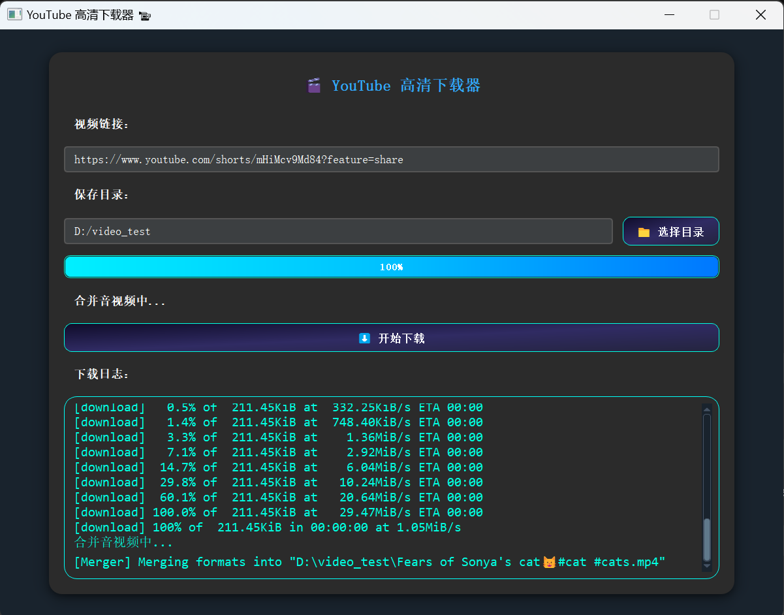

## 🎬 HD Downloader helper (PyQt5 + yt-dlp)

A modern, high-quality YouTube video downloader built with **PyQt5** and powered by **yt-dlp**.
It features a sleek UI, real-time download logs, ffmpeg integration, and system tray support.

### ✨ Features

* 🔗 Download videos via direct YouTube facebook tiktok bilibili and other popular video website links
* 📂 Customizable save directory
* 📉 Real-time progress tracking with a visual progress bar
* 📝 Download logs with status updates and error handling
* 🎥 Supports merging video and audio using `ffmpeg` (if installed)
* 💻 Stylish and dark-themed GUI using `qdarkstyle`
* ⚙️ Seamless multi-threading for UI responsiveness

### 📦 Tech Stack

* Python 3
* PyQt5
* yt-dlp
* ffmpeg (optional for enhanced functionality)
* qdarkstyle

### 📷 UI running Preview

